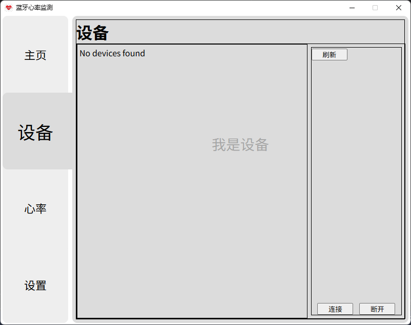

# Broadcast Heart Rate / 心率广播

## 图片



## 安装
### pyinstaller
```shell
pip install pyinstaller
```
---
### 依赖
```shell 
pip -r requirements.txt
```
---
### 打包
```shell
pyinstaller HeartRate.spec
```
###### or
```shell
pyinstaller -F -w --clean --add-data="src;src" --name HeartRate -i heartrate.ico main.py
```

## Lisense
* MIT
