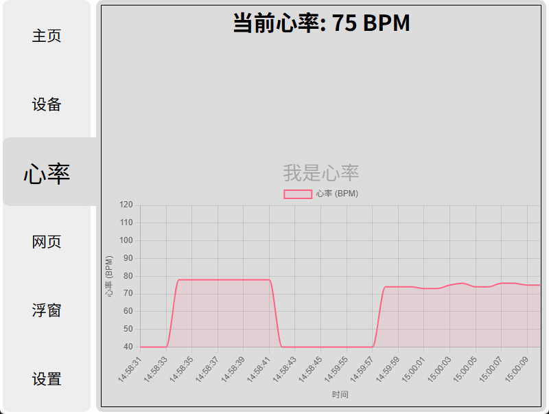
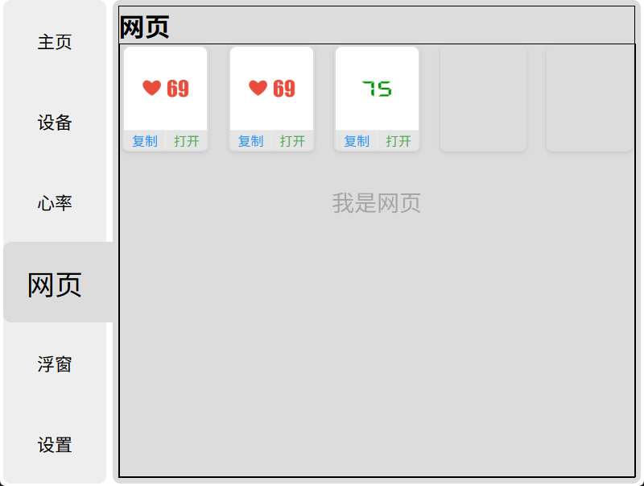

# Broadcast Heart Rate / 心率广播

## 介绍
一个用于接收心率广播的python程序

[https://github.com/SharkBee80/Broadcast_Heart_Rate](https://github.com/SharkBee80/Broadcast_Heart_Rate)

使用 `pywebview`.`bleak`.`flask` 模块

## 图片
<div>
    
    
    
</div>

## 安装
### pyinstaller
```shell
pip install pyinstaller
```
---
### 依赖
```shell 
pip -r requirements.txt
```
---
### 打包
```shell
pyinstaller HeartRate.spec
```
###### or
```shell
pyinstaller -F -w --clean --add-data="src;src" --name HeartRate -i heartrate.ico main.py
```

## Lisense
* [GPL-3.0](https://opensource.org/license/gpl-3-0)
<div>
    
</div>
